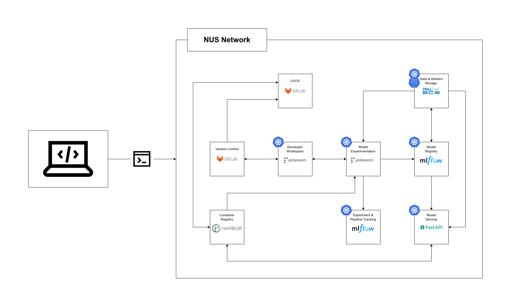
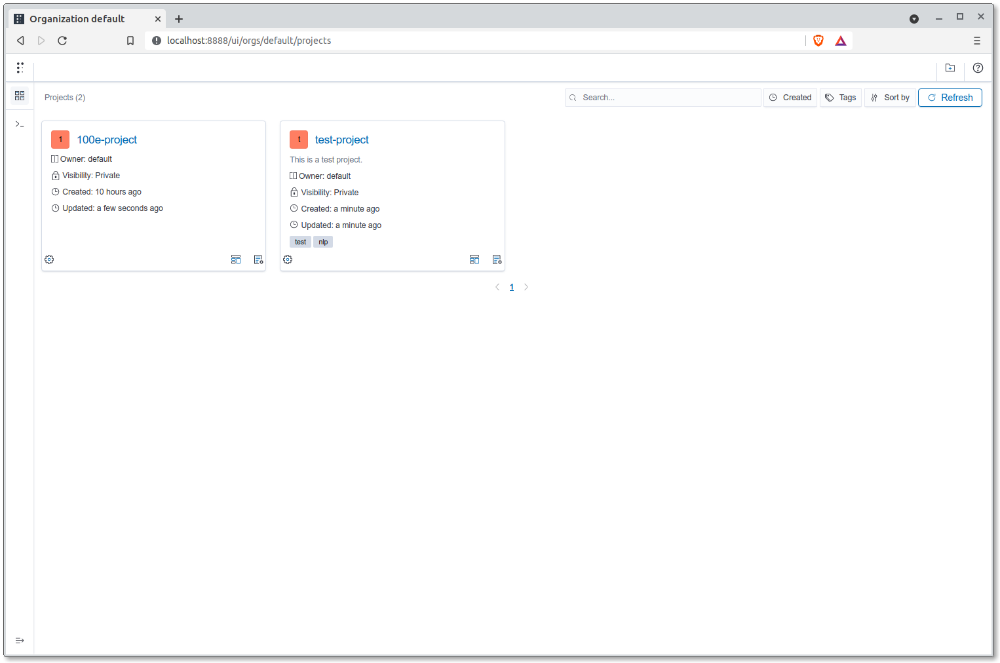

# MLOps Components & Platform

## Components Flowchart

The images below showcase the different components that this guide
will cover as well as how each of them relate to each other.



## Kubernetes

We will be using
[Kubernetes](https://kubernetes.io/)
as the underlying orchestration tool to execute
pipelines and manage containerised applications and environments.

From the Kubernetes site:

> _Kubernetes, also known as K8s, is an open-source system for_
> _automating deployment, scaling, and management of containerized_
> _applications. It groups containers that make up an application into_
> _logical units for easy management and discovery._

A number of services and applications that you will be interacting with
(or deploying) are deployed (to be deployed) within a
Rancher Kubernetes Engine (RKE) environment. An RKE cluster would have
been set up and a Kubernetes `config` file containing relevant
credentials should have been shared with you.

If this is not the case, please notify the MLOps team at
`mlops@aisingapore.org` or wherever any of the members are reachable.

Some of the MLOps components which the Kubernetes environment will be
relevant for are:

- Developer Workspace
- Model Experimentation
- Experiment & Pipeline Tracking
- Data & Artefact Storage
- Model Registry
- Model Serving

### `kubectl` Configuration for RKE

Throughout this template, we will be leveraging heavily on Kubernetes to
orchestrate our workflow and jobs; it's imperative that we set up our
Kubernetes client right.

By default, Kubernetes will seek for the credential files under the
directory `~/.kube`. Simply place the `config` file, provided by your
administrator under the directory `/.kube` to gain access to the
cluster relevant for the project.

!!! note
    The config file provided might be not be named `config`; simply
    rename and move the file into the directory as instructed above.

    If this is not your first Kubernetes cluster and you would like to
    consolidate your Kubernetes configurations, run the following
    __(after doing your due diligence by backing up the original file)__:

    === "Linux/macOS"

        ```bash
        $ export KUBECONFIG="<YOUR_EXPLICIT_HOME_DIRECTORY>/.kube/config:<PATH_TO_NEW_CONFIG_FILE>"
        $ kubectl config view --merge --flatten > config.new
        ```

    === "Windows PowerShell"

        ```powershell
        $ $KUBECONFIG="<YOUR_EXPLICIT_HOME_DIRECTORY>/.kube/config:<PATH_TO_NEW_CONFIG_FILE>"
        $ kubectl config view --merge --flatten > config.new
        ```

    The command above will generate a new compounded config file;
    rename the file to `config` and move it to `~/.kube`.

    You can now view the contexts that are made available by the new
    config file:

    ```bash
    $ kubectl config get-contexts
    ```

    To select and use a specific context, you can run the following:

    ```bash
    $ kubectl config use-context <CONTEXT_NAME>
    ```

    This would allow you to interact with the new cluster. Simply run
    the command above to switch between contexts. You may also install
    and use the [`kubectx`](https://github.com/ahmetb/kubectx) tool for
    easier switching of contexts.

After configuring access to your project's Kubernetes cluster,
you can start to interact with the main MLOps platforms tool that you
will be leveraging on for a development workspace, data preparation as
well as model training.

!!! caution

    Non-staff engineer accounts or tokens/configurations are granted
    limited permissions. Permissions for actionas such as viewing
    namespaces or deleting cluster resources might be off limits.

__Reference(s):__

- [Kubernetes Docs - Configure Access to Multiple Clusters](https://kubernetes.io/docs/tasks/access-application-cluster/configure-access-multiple-clusters/)

### Persistent Volumes

Containers are ephemeral and what that translates to is that any data
created and stored within the containers' file systems as well as any
changes made to it will be gone once the container is stopped.
To persist data or files, we would need to mount volumes to the
containers. With the default configuration provided in this template,
any services or jobs to be spun up on the MLOps Kubernetes platform will
have a persistent volume attached. The volume's mount path is
`/polyaxon-v1-data` and so anything that is stored within that path will
be persisted.

__Reference(s):__

- [Kubernetes Docs - Volumes](https://kubernetes.io/docs/concepts/storage/volumes/)
- [NetApp - What are Kubernetes persistent volumes?](https://www.netapp.com/knowledge-center/what-is-kubernetes-persistent-volumes/)

### Namespaces

Kubernetes allows for resources to be grouped in an isolated manner,
even within a single cluster. This is done through the usage of
namespaces. Examples for how namespaces can be used includes the
isolation of resources belonging to staging and production, or isolation
between different teams.

In the context of this template and guide, we will only stick with a
single namespace: `polyaxon-v1`, for simplicity's sake.
So whenever Kubernetes resources are to be set up, this namespace should
be specified.

__Reference(s):__

- [Kubernetes Docs - Namespaces](https://kubernetes.io/docs/concepts/overview/working-with-objects/namespaces/)

## Polyaxon

[Polyaxon](https://polyaxon.com) is an MLOps platform that provides a
suite of features for AI engineers to facilitate their end-to-end
machine learning workflows. The platform is to be deployed on a GKE
cluster; the Platforms team would have set the platform up for
your team upon creation of the Kubernetes cluster. AI engineers need not
worry about having to administer the platform as end-consumers of the
platform.

To verify if Polyaxon has been deployed on your GKE cluster,
you can run the following command:

```bash
$ helm list --namespace polyaxon-v1
NAME            NAMESPACE       REVISION        UPDATED                       STATUS          CHART           APP VERSION
polyaxon        polyaxon-v1     X               2021-XX-XX XX:XX:XX +0800 +08 deployed        polyaxon-1.11.3 1.11.3
```

An output similar to the one above should be returned.

### Polyaxon Dashboard

Now, let's access the dashboard for Polyaxon. Before we can interact
with the platform, we have to install the Polyaxon CLI. This should
ideally be done within a virtual Python environment. You can
conveniently get the relevant libraries for this guide by executing the
following command within the repository:

```bash
$ conda env create -f {{cookiecutter.repo_name}}-conda-env.yml
```

At any point of time you would like __to interact with the Polyaxon
server, you would need port forwarding of the Polyaxon Kubernetes
service to your localhost__.
You can do port forwarding to a port on the localhost with
the Polyaxon CLI (we'll go ahead with the port `8117`):

```bash
$ polyaxon port-forward --port=8117 --namespace=polyaxon-v1
```

!!! tip
    The above process would occupy your current terminal. If you'd like
    the process to run in the background instead of opening up another
    terminal window/tab, you can run the following commands:

    === "Linux/macOS"

        ```bash
        $ polyaxon port-forward --port=8117 --namespace=polyaxon-v1 & > /dev/null 2>&1 &
        ```

    === "Windows PowerShell"

        ```powershell
        $ Start-Process polyaxon -ArgumentList "port-forward --port=8117 --namespace=polyaxon-v1"
        ```

    However, for Linux/macOS, to end these processes that are running in
    the background,
    you cannot simply abort the process by using `Ctrl + C`. Do look
    at
    [this resource](https://itsfoss.com/how-to-find-the-process-id-of-a-program-and-kill-it-quick-tip/)
    on how to kill running (background) processes.

Open up a browser and head over to `localhost:8117`. You should see an
interface as such:



Before we can create any services or run jobs on the platform, we have
to configure the host for the CLI and create a project within the
platform:

```bash
$ polyaxon config set --host=http://localhost:8117
$ polyaxon project create --name {{cookiecutter.repo_name}}-<YOUR_NAME>
```

After the command above, you should see a project with the name you've
specified above in the
[projects dashboard](http://localhost:8117/ui/orgs/default/projects).

__Reference(s):__

- [Ampersands & on the command line](https://bashitout.com/2013/05/18/Ampersands-on-the-command-line.html)

### Relevant Concepts

Before we proceed further, let's cover some basic concepts that one
should know when getting started with Polyaxon.

__Polyaxonfiles:__

To submit jobs or spin up services on the Polyaxon platform, users would
have to make use of both the CLI as well as Polyaxon-specific config
files known as Polyaxonfiles. The CLI establishes communications and
connections with the Polyaxon server while Polyaxonfiles provide
specification to the server for the kind of request you are making.
Polyaxonfiles can be written and defined in several formats
(YAML, JSON, Python, and some other languages) but in
AI Singapore's context, we will be sticking with YAML.
Polyaxonfile boilerplates can be found under
`aisg-context/polyaxon/polyaxonfiles`.

Head over [here](https://polyaxon.com/docs/core/specification/) for the
official documentation on Polyaxonfiles.

__Components:__

Before you can define a job or service for Polyaxon, you would have to
call upon and define a component. Hence, in every Polyaxonfile that is
provided as an example, you see the following lines
at the very beginning:

```yaml
version: 1.1
kind: component
...
```

From the official documentation:

> _Component is a discrete, repeatable, and self-contained action that_
> _defines an environment and a runtime._

Essentially, a "component" is to represent a discrete aspect of your
end-to-end workflow. You can have one component for your development
environment, one for your data preparation pipeline, and another for
your model training workflow. You can also have different components for
different variations of your pipelines. However, for these workflows to
be defined, we have to start with specifying a component.
Shown [here](https://polyaxon.com/docs/intro/concepts/runtime-concepts/),
you can specify various runtimes
(experimentation tools) you would like to spin up on the Polyaxon
server.

__Reference(s):__

- [Polyaxon Docs - Component Specification](https://polyaxon.com/docs/intro/quick-start/components/)
- [Polyaxon Docs - Polyaxon experimentation tools](https://polyaxon.com/docs/experimentation/)

__Jobs:__

One example of such components is "jobs". You can run jobs for training
models, data preprocessing or any generic tasks that are executable
within Docker containers. Whenever you need to execute a pipeline or a
one-off task, "jobs" is the right runtime to go for.

__Reference(s):__

- [Polyaxon Docs - Jobs Introduction](https://polyaxon.com/docs/experimentation/jobs/)

__Services:__

The "services" runtime is used for spinning up applications or
interfaces that are to remain running until you stop the service
(or an error is faced on the server's end).
You can spin up services the likes of a VSCode editor that would
be accessible via a browser, a Jupyter Lab server or a REST API server.

__Reference(s):__

- [Polyaxon Docs - Services Introduction](https://polyaxon.com/docs/experimentation/services/)

We will dive deeper into these concepts and the usage of each one of
them in later sections.

### Secrets & Credentials on Kubernetes

When executing jobs on Kubernetes, credentials have to be attached to
the pods for access to various on-premise resources such as ECS or the
Harbor container registry. To provide your container jobs
(or even services) with access
to these credentials, you first need to create them.
In the example below, we will be creating Kubernetes secrets that will
contain credentials for ECS and Harbor.

!!! note
    Credentials for ECS and Harbor can be obtained by the project lead
    or the MLOps team.

1. Before creating the secrets, do check if they currently exist first:

=== "Linux/macOS"

    ```bash
    $ kubectl get secret --namespace=polyaxon-v1 | grep -E 'harbor-credentials|ecs-s3-credentials'
    ```

=== "Windows PowerShell"

    ```powershell
    $ kubectl get secret --namespace=polyaxon-v1 | Select-String "harbor-credentials"
    $ kubectl get secret --namespace=polyaxon-v1 | Select-String "ecs-s3-credentials"
    ```

2. If they do not exist, we can create the secrets like so:

=== "Linux/macOS"

    ```bash
    $ export HARBOR_ROBOT_USER=<YOUR_HARBOR_ROBOT_USER_HERE>
    $ export HARBOR_SECRET=<YOUR_HARBOR_SECRET_HERE>
    $ export PATH_TO_S3_CREDENTIALS=<PATH_TO_ECS_S3_CREDENTIALS>
    $ kubectl create secret docker-registry harbor-credentials \
      --docker-server=https://registry.aisingapore.net \
      --docker-username="$HARBOR_ROBOT_USER" \
      --docker-password="$HARBOR_SECRET" \
      --namespace=polyaxon-v1
    $ kubectl create secret generic ecs-s3-credentials \
      --from-literal=awsAccessKeyID='<YOUR_AWS_ACCESS_KEY_ID_HERE>' \
      --from-literal=awsSecretAccessKey='<YOUR_AWS_SECRET_ACCESS_KEY_HERE>' \
      --from-literal=ecsS3EndpointURL='https://necs.nus.edu.sg' \
      --namespace=polyaxon-v1
    ```

=== "Windows PowerShell"

    ```powershell
    $ $HARBOR_ROBOT_USER=<YOUR_HARBOR_ROBOT_USER_HERE>
    $ $HARBOR_SECRET=<YOUR_HARBOR_SECRET_HERE>
    $ $PATH_TO_S3_CREDENTIALS=<PATH_TO_ECS_S3_CREDENTIALS>
    $ kubectl create secret docker-registry harbor-credentials `
      --docker-server=https://registry.aisingapore.net `
      --docker-username="$HARBOR_ROBOT_USER" `
      --docker-password="$HARBOR_SECRET" `
      --namespace=polyaxon-v1
    $ kubectl create secret generic ecs-s3-credentials `
      --from-literal=awsAccessKeyID='<YOUR_AWS_ACCESS_KEY_ID_HERE>' `
      --from-literal=awsSecretAccessKey='<YOUR_AWS_SECRET_ACCESS_KEY_HERE>' `
      --from-literal=ecsS3EndpointURL='https://necs.nus.edu.sg' `
      --namespace=polyaxon-v1
    ```

## Harbor Container Registry

AI Singapore's emphases on reproducibility and portability of
workflows and accompanying environments translates to heavy usage of
containerisation. Throughout this guide, we will be building Docker
images necessary for setting up development environments, jobs for
the various pipelines and deployment of predictive models.

Within the context of on-premise resources,
[Harbor](https://github.com/goharbor/harbor)
will be used to store and version our Docker images.

Please refer to [this section](./02-preface.md#container-registry) to log in to the
image registry.

__Reference(s):__

- [Docker - Pushing & Pulling Images](https://docs.docker.com/engine/reference/commandline/images)
- [Harbor Docs - Pulling and Pushing Images in the Docker Client](https://goharbor.io/docs/1.10/working-with-projects/working-with-images/pulling-pushing-images/)
